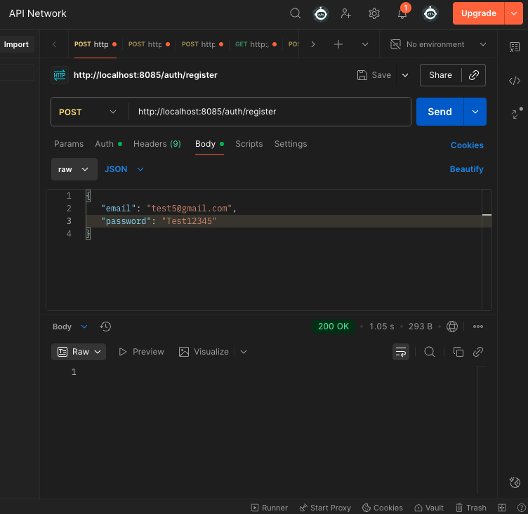
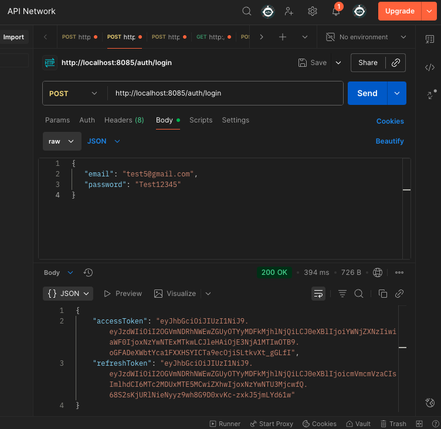
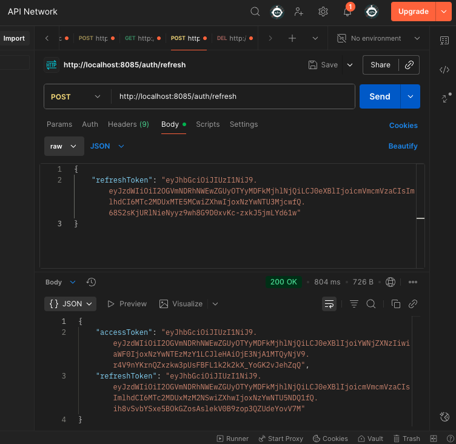
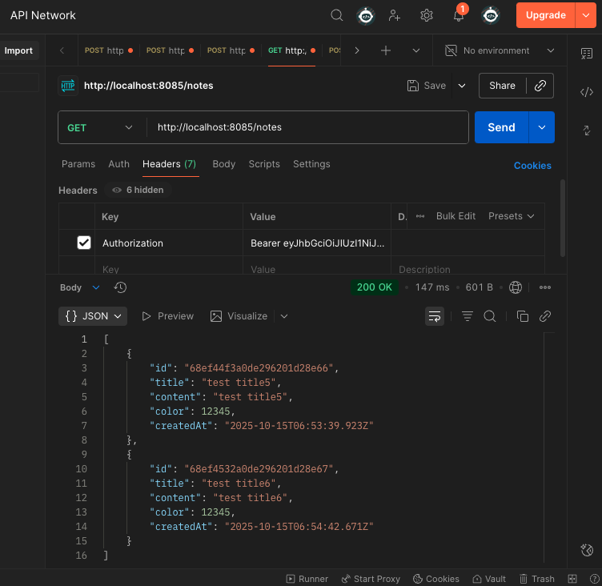
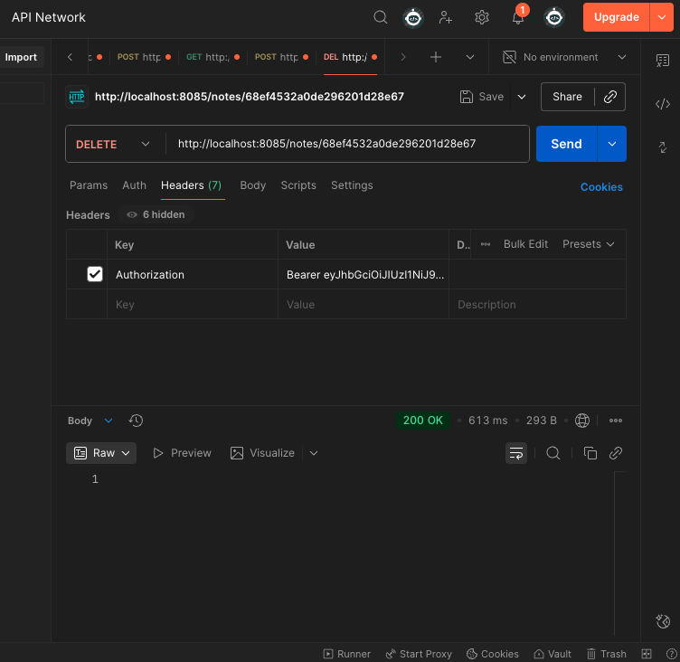

# 🗒️ Notes Backend (Spring Boot + Kotlin + MongoDB)

This is a backend service for a Notes application built with **Spring Boot (Kotlin)** and **MongoDB**.  
It provides secure authentication using JWT (access & refresh tokens) and CRUD APIs for managing notes.

---

## 🚀 Features

- User registration & login
- JWT authentication (Access + Refresh tokens)
- Create, Read, Update, Delete notes
- MongoDB persistence
- RESTful API design
- Error handling with custom responses

---

## 🧠 Tech Stack

| Layer          | Technology    |
|----------------|---------------|
| Language       | Kotlin        |
| Framework      | Spring Boot   |
| Database       | MongoDB       |
| Authentication | JWT           |
| IDE            | IntelliJ IDEA |

---

## ⚙️ Setup & Run

### Clone the repository

```bash
1️⃣
git clone https://github.com/AbuBakar583/NotesBackend.git
cd NotesBackend

2️⃣ Configure MongoDB

Make sure MongoDB is running locally or provide your cloud Mongo URI in application.properties:
spring.data.mongodb.uri=mongodb+srv://<username>:<password>@<cluster-url>/<dbname>
3️⃣ Run the server

In IntelliJ IDEA → Click Run ▶️
Or use:

./gradlew bootRun

Server runs by default on:
👉 http://localhost:8085
🔑 Authentication APIs
📝 Register User

POST /auth/register

Body:

{
  "email": "test@test.com",
  "password": "123456"
}


Response Example: 200 OK



🔐 Login User

POST /auth/login

Body:

{
  "email": "test@test.com",
  "password": "123456"
}


Response:

{
  "accessToken": "eyJhbGciOiJIUzI1NiIsInR5cCI...",
  "refreshToken": "eyJhbGciOiJIUzI1NiIsInR5cCI..."
}



🔄 Refresh Token

POST /auth/refresh

Body:

{
  "refreshToken": "<your-refresh-token>"
}


Response:

{
 "accessToken": "eyJhbGciOiJIUzI1NiIsInR5cCI...",
  "refreshToken": "eyJhbGciOiJIUzI1NiIsInR5cCI..."
}



🗒️ Notes APIs (Authorized)
➕ Create Note

POST /notes

Headers:

Authorization: Bearer <access_token>


Body:

{
  "title": "My First Note",
  "content": "This is an example note.",
  "color": 123456
}


Response:

{
  "id": "652a9b8c3c4b1a12d8e7a123",
  "title": "My First Note",
  "content": "This is an example note.",
  "color": 123456
}


📋 Get All Notes

GET /notes

Response Example:

[
  {
    "id": "652a9b8c3c4b1a12d8e7a123",
    "title": "My First Note",
    "content": "This is an example note.",
    "color": 123456
  }
]



🗑️ Delete Note

DELETE /notes/{id}



